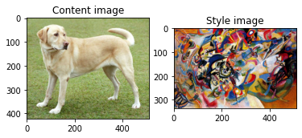
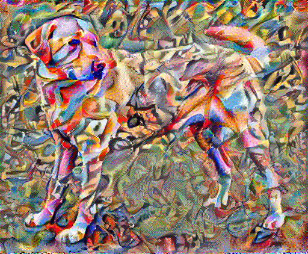

# style-transfer
Implementation of Neural Style Transfer according to Tensorflow tutorial.
# Workflow
1. The network is fed with two images, one providing content and one providing style, as the following ones:

2. The network then extracts the features from both images (relying on VGG19), and combines them according to certain weights specified by the user:

#### Author:
Mattia Orlandi

#### Credits:
[Neural Style Transfer](https://www.tensorflow.org/tutorials/generative/style_transfer)